# Deutsch A2 → C1 — Sprachspezifikation

German grammar taught as a type system. A static React app with a focused,
chapter-by-chapter Learning Mode and an unrestricted Free Mode: a 32-module
A2–C1 reference, a drill engine that generates questions fresh and weights them
toward your weak spots, an adaptive CEFR placement exam, and a writing trainer
that sends your text to Claude for a graded, rule-by-rule correction.

No backend. Everything runs in the browser and progress stays in `localStorage`.

---

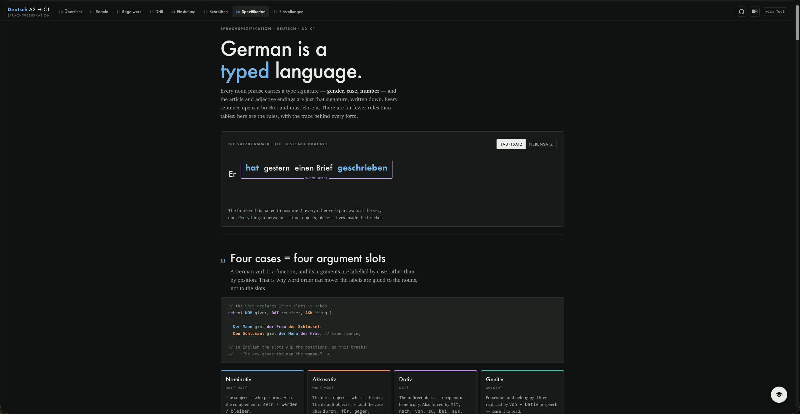

## Screenshots

| Übersicht | Regeln | Drill |
|---|---|---|
| [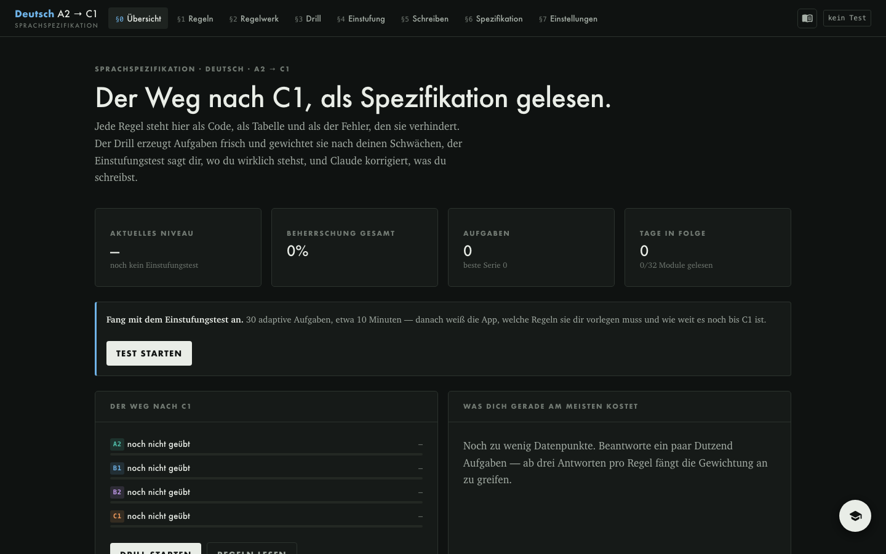](docs/screenshots/dashboard.png) | [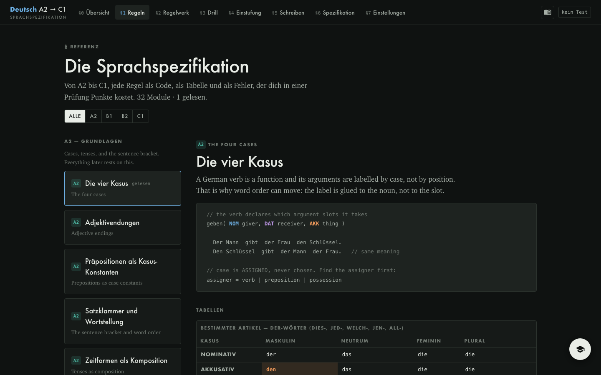](docs/screenshots/learn.png) | [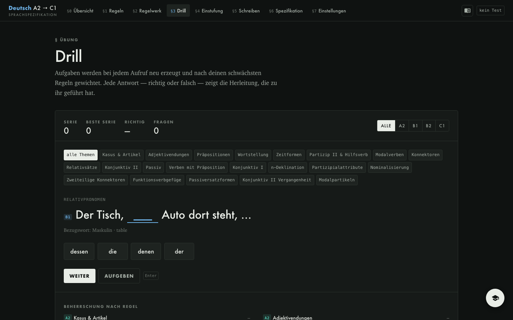](docs/screenshots/drill.png) |

| Einstufung | Schreiben | Einstellungen |
|---|---|---|
| [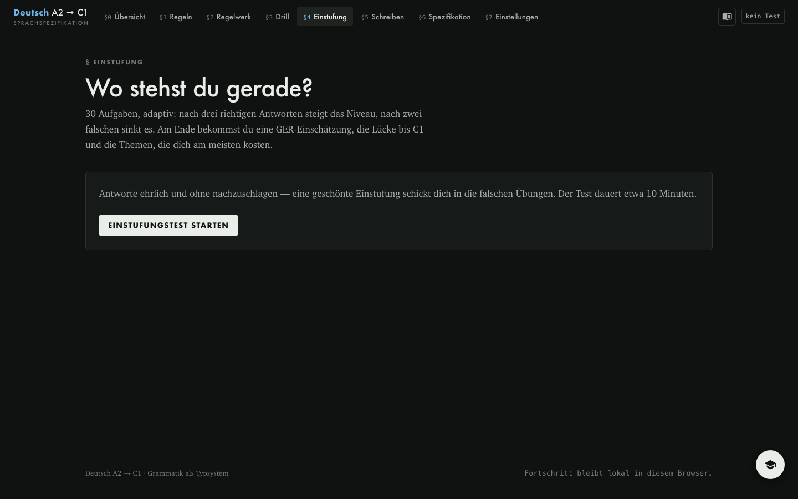](docs/screenshots/exam.png) | [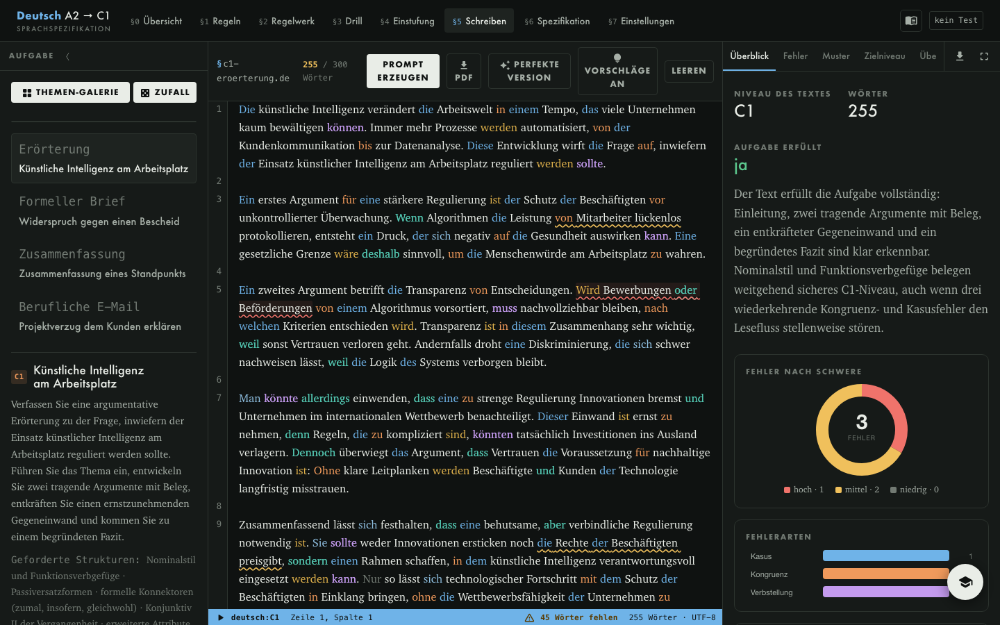](docs/screenshots/write.png) | [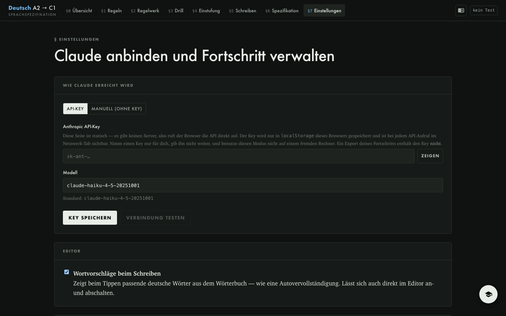](docs/screenshots/settings.png) |

---

## Run it

```bash
npm install
npm run dev
```

Build a static bundle:

```bash
npm run build
```

The output lands in `dist/`. `vite.config.js` sets `base: "./"`, so the same
build works at `username.github.io`, at `username.github.io/repo/`, and from the
local filesystem — no path configuration needed.

Learning Mode is enabled by default. To build the original Free Mode only and
hide all learning-path controls:

```bash
VITE_LEARNING_PATH_ENABLED=false npm run build
```

## Deploy to GitHub Pages

`.github/workflows/deploy.yml` builds and publishes on every push to `main`.
One-time setup: in the repository, go to **Settings → Pages → Build and
deployment → Source** and choose **GitHub Actions**. Then:

```bash
git init && git add -A && git commit -m "Deutsch A2 → C1"
git branch -M main
git remote add origin git@github.com:<user>/<repo>.git
git push -u origin main
```

---

## What's in it

| Bereich | Was es tut |
|---|---|
| **§0 Lernpfad** | One guided learning window from A1/A2 foundations to C1. It sequences explanation, preconfigured exercises, and a short writing application without sending the learner to other tools. |
| **§1 Regeln** | 32 modules A2→C1. Each one: the rule as code, the table it collapses to, real examples, and the mistakes that cost marks in an exam. |
| **§2 Drill** | 21 generators produce questions on demand. Every answer — right or wrong — prints the derivation that produced it. Weighted toward your weakest rules. |
| **§3 Einstufung** | 30 adaptive questions. Climbs after three correct at a level, drops after two wrong. Returns a CEFR estimate, the gap to C1, and your weakest topics. |
| **§5 Spickzettel** | 24 exam task types taken from the Goethe, telc, TestDaF and DSH model papers — each with the mechanical trick that solves it, the traps built into it, a wrong-next-to-right example, and what changes about it at A2, B1, B2 and C1. Plus part-by-part blueprints of eight real exams and a per-level page of what an examiner expects. Available in both modes. |
| **§4 Schreiben** | 12 exam-style writing tasks A2→C1. Claude returns a CEFR estimate, marks per criterion, every error with its rule, correct-but-below-level phrasings with their target-level version, and your text rewritten at level. |
| **§5 Einstellungen** | API key, mode, export/import, reset. |

### The grammar engine

`src/engine/grammar.js` derives forms rather than storing them: articles and
adjective endings from the case/gender tables, all six tenses plus Konjunktiv I
and II and the full passive paradigm by composition. Konjunktiv I applies the
real fallback rule — if the form would be identical to the indicative, it
switches to Konjunktiv II and says so.

`src/engine/drills.js` turns that into questions. `src/engine/exam.js` runs the
adaptive ladder and estimates the level.

---

## Teacher Chat

Ask questions to the teacher (powered by Claude) and learn more how to write and understand German.

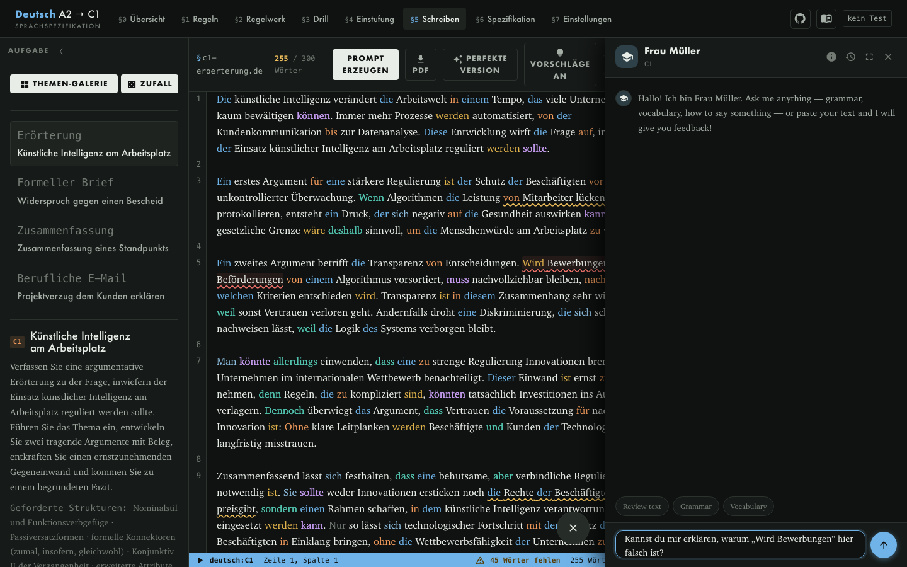

Frau Müller is always there to give you a hand and answer your question!

## Learn to Write like in an IDE

"Code" in the German language, like you would be learning a programming language, get highlighted chars which will enable you to understand the syntax. Let your imagination flow and get corrected by AI giving you recommendations on how to improve your german writting and what are you fails.

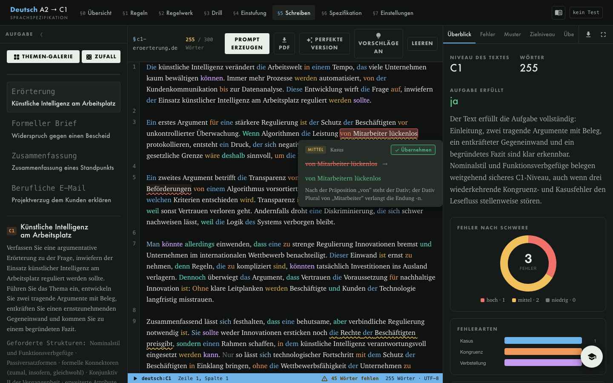

### Correction

Get recommendations to improve your text:

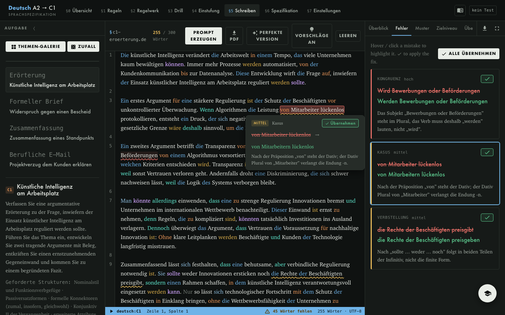

### Learn from your errors

Practice based on your own mistakes, and learn how to do it right and why.

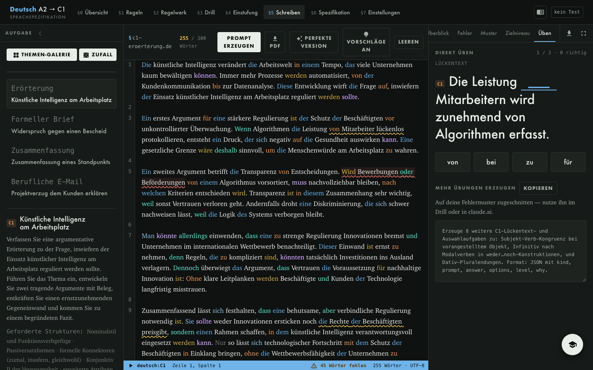

## Connecting Claude

Two modes, switchable in **§5 Einstellungen**.

### Manual (no key) — the safe default

The app builds the full prompt including the JSON schema. You paste it into
claude.ai, the Claude app, or Claude Code, and paste the JSON answer back. The
app parses and renders it exactly as if it had called the API. Nothing leaves
the page except what you copy yourself.

### API key

This is a static site with no server, so the browser calls the Anthropic API
directly. That means:

- The key is stored in this browser's `localStorage` and is visible in the
  network tab on every request.
- Anyone with access to the browser profile can read it.
- Use a key scoped to you, don't use this mode on a shared machine, and rotate
  the key if you ever publish the site somewhere others use it.
- **A progress export never contains the key** — it is stored under a separate
  `localStorage` entry and excluded from the export.
- The header and API settings count input, output, and cached tokens used by
  this app for each key. The available figure is Anthropic's latest rolling
  token rate-limit value; standard API keys do not expose an account credit
  balance. The local counter can be reset independently of learning progress.

The API path uses the official `@anthropic-ai/sdk` with
`dangerouslyAllowBrowser: true`, `claude-sonnet-5`, and structured outputs, so
the response is schema-validated JSON rather than prose to parse.

Get a key at [console.anthropic.com](https://console.anthropic.com/settings/keys).
Requests are billed to your own account.

### What Claude is asked to do

1. **Correct writing** — CEFR estimate with reasons, 0–5 per criterion
   (Aufgabe, Kohärenz, Wortschatz, Grammatik, Register), every error as
   `original → corrected` with the rule behind it and a severity, up to three
   below-level phrasings with their target-level version, and the whole text
   rewritten at level. The correction schema is scoped to the selected CEFR
   level: higher-level grammar cannot be returned as an assessed error or used
   to block course progression.
2. **Generate challenges** — 8 fresh questions aimed at your weakest rules. The
   built-in generators have fixed patterns; Claude does not.
3. **Explain a mistake** — on a wrong drill answer: the rule, why your answer
   fails, a minimal pair, and a mnemonic.

---

## Learning and Free modes

**Learning Mode** deliberately shows one learning window plus Settings. Related
chapters are grouped into 11 named learning blocks such as A2.1 and B1.2. Each
chapter contains an introduction, explanation, and preconfigured exercises; a
rolling checkpoint requires 3 correct answers out of the latest 4. The learner
then continues with the next connected rule. A short writing application appears
only at the end of a block (usually after 2–3 chapters) and deliberately combines
all rules in that block. This avoids gating progress on a text before its
supporting grammar has been taught. Before the guided path advances from A2 to
B1, B1 to B2, or B2 to C1, a mandatory level exam asks one question from every
chapter in the completed level and requires an 80% score. Failed attempts identify
the chapters to review and remain retryable; passing attempts are saved with the
learning progress. The header reports the current block, CEFR level, and total
path progress. In Settings, the learner can jump directly to
A1/A2, B1, B2, or C1 if browser progress was lost; jumping does not falsely mark
earlier chapters complete.

**Free Mode** is the original unrestricted interface. Every reference, drill,
exam, and writing tool remains available. Users can switch modes in Settings
without losing either kind of progress.

### AI learning coach

Every Learning Mode chapter includes an optional, clearly labelled
**KI-Lernbegleiter**. It builds a compact anonymous profile from rule accuracy,
recent checkpoint results, completed chapters, the last placement level, and
error-category metadata from prior corrections. Raw learner writing is not sent
when creating this profile.

The model returns a structured personalization pack for the current chapter:
an individual focus with evidence, an adapted explanation and memory hook,
targeted examples, four warm-up exercises, and a tailored block application
that is shown when the learner reaches the end of that learning block.
The pack is cached in browser progress, so it does not need to be regenerated
on every visit. API-key and manual copy/paste modes are both supported.

AI output cannot change the CEFR sequence or pass a learner. AI exercises are
explicitly treated as warm-up material; only the built-in grammar generator and
its fixed 3-of-4 checkpoint update mastery and unlock progression. The complete
built-in lesson remains available when AI is disabled or unavailable.

## Progress

Stored in `localStorage` under `dc1:progress`: learning-path chapter/checkpoint
state, cached AI personalization packs, per-rule mastery, streaks, daily counts,
exam history, and every submitted text with its correction.

- **Export / Import** — JSON, in §5. Use it to move between browsers or to keep
  a backup, since clearing site data wipes the store.
- **Reset** — §5, behind a confirmation. Clears mastery, streaks, exams and
  texts. The API key is separate and is deleted with its own button.

---

## Project layout

```
src/
  data/
    lexicon.js      nouns, verbs, modals, prepositions, connectors, phrase banks
    curriculum.js   32 grammar modules A2→C1
    writing.js      12 writing tasks + the CEFR marking criteria
  engine/
    grammar.js      declension + conjugation, each with its rule trace
    drills.js       21 question generators + weak-rule weighting
    exam.js         adaptive ladder, fixed item bank, CEFR estimator
  lib/
    claude.js       Anthropic SDK calls + the manual copy/paste prompts
    storage.js      localStorage, export/import, reset
  components/       Dashboard · Learn · Drill · Exam · Write · Settings
```

---

## Support the project

If this project helps you learn German, you can
[buy me a coffee with PayPal](https://paypal.me/mathiasbrunkowmoser).

<a href="https://paypal.me/mathiasbrunkowmoser">
  
</a>

Made with ♥ by [Mathias Brunkow Moser](https://github.com/matbmoser).

---

## License

GPL-3.0-or-later — see [LICENSE](LICENSE).

## AI-generated content

The code and content in this repository were generated with AI assistance
(Claude Code, Anthropic), directed and edited by the author.

AI makes mistakes, most of the content was verified by a German Teacher
